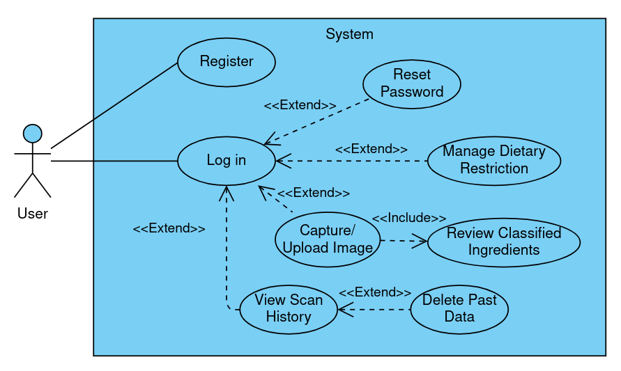

# Ingredient Checker: Requirements Specification  

## Table of Contents
- [1. Project Statement](#1-project-statement)
- [2. Stakeholders and User Groups](#2-stakeholders-and-user-groups)
- [3. Motivation for Use](#3-motivation-for-use)
- [4. Example Use Scenario](#4-example-use-scenario)
- [5. Requirements Analysis](#5-requirements-analysis)
  - [5.1 Functional Requirements](#51-functional-requirements)
  - [5.2 Non-functional Requirements](#52-non-functional-requirements)
- [6. Technical and Software Constraints](#6-technical-and-software-constraints)
- [7. Evaluation Criteria](#7-evaluation-criteria)
- [8. Additional Considerations](#8-additional-considerations)

---

## 1. Project Statement

Ingredient Checker is an Android mobile application proposed to help users make informed food choices by analyzing product ingredient lists from Turkish food packaging. After capturing a photo of a product’s ingredient list, OCR (Optical Character Recognition) and NLP (Natural Language Processing) are performed on a cloud service (i.e., AWS Lambda). The ingredients are then classified according to user-selected dietary restrictions (celiac, vegan, nut allergy) as "safe", "potentially unsafe", or "definitely unsafe", in order to help users decide whether a product is suitable for them.

---

## 2. Stakeholders and User Groups

1. **End Users (Consumers)**  
   - Individuals with specific dietary restrictions (celiac, vegan, nut allergies).  
   - Health-conscious consumers looking for a straightforward method to confirm product suitability.

2. **Healthcare Professionals (Nutritionists or Dieticians)**  
   - May offer guidance on classification criteria.  
   - Could use the tool to verify product safety for patients with food-related allergies or sensitivities.

---

## 3. Motivation for Use

- **Food Safety and Dietary Compliance**  
  Users need a reliable way to verify whether a product is suitable for their dietary requirements.

- **Convenience**  
  Quickly scanning labels instead of reading through small and cluttered ingredient text.

- **Health Awareness**  
  Raises awareness about hidden ingredients or allergens.
   
---

## 4. Example Use Scenario

### 4.1 User Story

> Onat has celiac disease and wants to check if a snack is gluten-free. He opens the Ingredient Checker app on Android, logs in, and sets his dietary restriction to *celiac*. Onat snaps a photo of the ingredient list. The app uploads the photo to the cloud for processing, detects "wheat flour", and flags it as "definitely unsafe". Onat decides not to buy the snack. Long after the incident, Onat craves that snack again, so he checks the scan history without having to go to the grocery store, to see that he cannot have it.

### 4.2 UML Use-Case Diagram

---

## 5. Requirements Analysis

### 5.1 Functional Requirements

1. **User Management**  
   - 1.1: The system must allow new users to register with a valid email or username and password.  
   - 1.2: The system must allow returning users to log in with their registered credentials.  
   - 1.3: The system must allow users to reset their passwords.

2. **Dietary Preference Management**  
   - 2.1: The system must allow users to set or update their dietary restriction (celiac, vegan, nut allergy).

3. **Image Capture and Upload**  
   - 3.1: The user must be able to take a photo of the product’s ingredient list via device camera or upload one from the gallery.  
   - 3.2: The system must send the captured image to a serverless FaaS (e.g., AWS Lambda) for processing.

4. **OCR (Optical Character Recognition)**  
   - 4.1: The system must extract text from the uploaded image using a cloud-based OCR service or an open-source library.  
   - 4.2: The system must apply basic image preprocessing (e.g., cropping, noise reduction) to improve OCR accuracy.

5. **NLP (Natural Language Processing) Classification**  
   - 5.1: The recognized text (ingredient list) must be parsed using an NLP approach, either rule-based or ML-based.  
   - 5.2: Each ingredient must be classified as safe, potentially unsafe, or definitely unsafe, based on the selected dietary restriction.  
   - 5.3: The classification logic must reference the national food composition database from the Turkish Ministry of Agriculture and Forestry.

6. **Result Presentation**  
   - 6.1: The system must display classification results in a user-friendly, visually clear, color-coded format.  
   - 6.2: The system must highlight any potentially unsafe or definitely unsafe ingredients with significant emphasis.

7. **Data Management**  
   - 7.1: The system must store previous scans (images plus classification outcomes) in a database for future reference.  
   - 7.2: Users must be able to retrieve previously scanned products and review their classification results.  
   - 7.3: The system must allow users to delete their past scan data upon request.

---

### 5.2 Non-functional Requirements

1. **Performance**  
   - 1.1: The OCR and NLP classification process should typically respond within a few seconds under normal network conditions.  
   - 1.2: The mobile application should remain responsive without freezing or crashing during the upload and waiting process.

2. **Accuracy**  
   - 2.1: The OCR technology should achieve an accuracy rate of 90% or higher, granted typical lighting and photographic conditions are met.  
   - 2.2: NLP classification precision and recall should be measured and improved over time in collaboration with dieticians.

3. **Usability**  
   - 3.1: The interface should follow UI/UX guidelines to ensure intuitive navigation and layout.  
   - 3.2: Text and icons should be visually accessible (e.g., proper contrast, legible font sizes).
   - 3.3: Users should be provided with guidelines on how to navigate through the application.

4. **Security and Data Privacy**  
   - 4.1: User data must be encrypted in transit.  
   - 4.2: The system should utilize secure authentication to prevent unauthorized access.
   - 4.3: The system must not store more data than is required for essential functionality.

5. **Scalability**  
   - 5.1: The cloud infrastructure must handle growing numbers of requests with minimal performance loss.  
   - 5.2: The cloud architecture must auto-scale as usage increases.

6. **Reliability and Availability**  
   - 6.1: The system should be available 24/7 with minimal scheduled downtime.  
   - 6.2: Clear error messages should be provided if the network or server fails, and the system should retry processing when possible.

7. **Maintainability**  
   - 7.1: The codebase should be modular to allow updates or replacements of OCR/NLP libraries with ease.  
   - 7.2: Documentation for requirements and and code must be kept current.

---

## 6. Technical and Software Constraints

- **Operating System:** Android  
- **Programming Languages:**  
  - **Mobile:** React Native or Flutter for frontend (as backend logic is handled in the cloud)
  - **Serverless Functions:** Node.js or Python
- **Libraries and Frameworks:**  
  - **OCR:** AWS Rekognition or Tesseract OCR  
  - **NLP:** AWS Comprehend or Python-based libraries (spaCy, NLTK)  
- **APIs, Services, and Database:**  
  - **AWS Lambda** for serverless processing of OCR, NLP, and classification  
  - **AWS S3** for storing images  
  - **AWS RDS** for relational user data and scan history (storing S3 object identifiers alongside classification results) 
- **IDE:** 
  - VSCode (or another code editor)

---

## 7. Evaluation Criteria

1. **Quality Measurements**  
   - OCR accuracy rate (percentage of recognized words versus total words)  
   - NLP precision and recall (how effectively unsafe or safe ingredients are identified)

2. **Performance Metrics**  
   - Error rate (frequency of OCR or classification failures)  
   - Latency (time from photo capture to classification result)  
   - Scalability (ability to handle increased load without degraded performance)

3. **User Experience**  
   - App responsiveness (quick screen transitions and rapid result display)
   - Record of crashes as a measure of stability

---

## 8. Additional Considerations

- Consider consultations so that classification rules remain up-to-date with food regulations and dietary guidelines.  
- Application must strictly adherence to data privacy laws (KVKK); disclaimers may be needed regarding the accuracy of the classifications.
- Since AWS Lambda and related services handle the core functionality, a dedicated backend is not really necessary. The Android app can communicate directly with AWS services.
- Primary OCR/NLP tasks are expected to run in the cloud for better accuracy and performance, but a basic local fallback should be addressed for use-case contingencies (e.g., privacy, poor reception).
